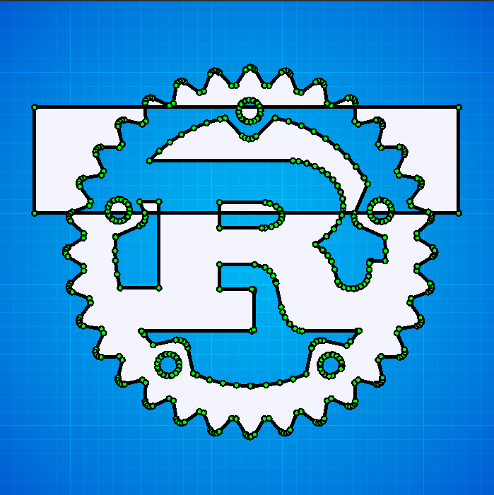

# Lyon
GPU-based 2D graphics rendering experiments in rust.

# Goals

For now the goal is to provide efficient SVG-compliant path tesselation tools to help with rendering vector graphics on the GPU. If things go well the project could eventually grow into including a (partial) SVG renderer in a separate crate, but for now think of this library as a way to turn complex paths into triangles for use in your own rendering engine.

The intent is for this library to be useful in projects like [Servo](https://servo.org/).

The project is split into small crates:
* lyon: A meta-crate that imports the other crates.
* lyon_core: Contains types common to most lyon crates.
* lyon_tesselator: The tesselation routines (where most of the focus is for now).
* lyon_extra: various optional utilities.

## TODO

There is a [rough list of things to do](https://github.com/nical/lyon/wiki/TODO). If you are interested in [contributing](https://github.com/nical/lyon/wiki/Contribute), please let me know on twitter ([@nicalsilva](https://twitter.com/nicalsilva)) or by e-mail.

## Status

The focus right now is on implementing a SVG compliant path tesselator (rather than an actual SVG render).
The tesselator can currently only operate on flattened paths. It is able to handle most complex cases including self intersections, but there are still some bugs that need to be found and fixed. The API is not stable at all.

## License

Licensed under either of

 * Apache License, Version 2.0 ([LICENSE-APACHE](LICENSE-APACHE) or http://www.apache.org/licenses/LICENSE-2.0)
 * MIT license ([LICENSE-MIT](LICENSE-MIT) or http://opensource.org/licenses/MIT)

at your option.

### Contribution

Unless you explicitly state otherwise, any contribution intentionally submitted for inclusion in the work by you, as defined in the Apache-2.0 license, shall be dual licensed as above, without any additional terms or conditions.

