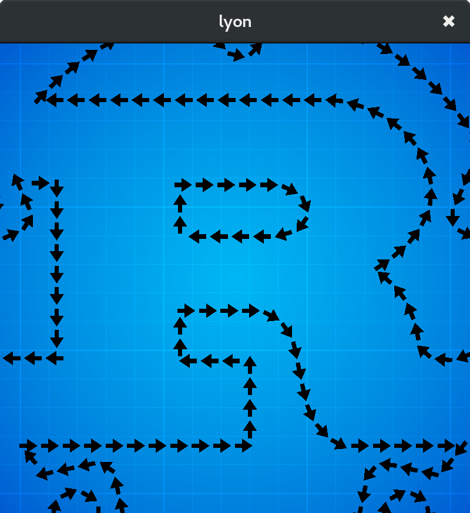

# Path walking example

An example program showing how to instanciate objects along a path.

This program tessellate a simple shape (an arrow) and use instanced rendering with gfx-rs to place and render this shape at regular intervals along the path of the rust logo.

## Screenshot

