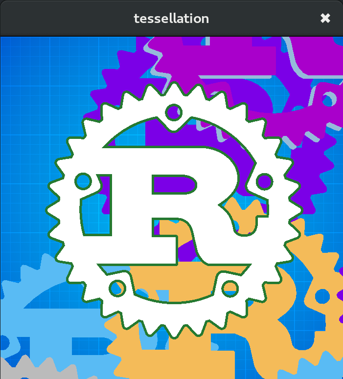

# wgpu example

An example program showing what integrating lyon's tessellators in a GPU-based renderer could look like.

This program renders the rust logo (fill and stroke). The geometry is tessellated once at initialization and stays on the GPU. Some parameters such as color and stoke width are stored in a uniform buffer that is updated every frame. Opaque geometry is draw in front-to-back order with the depth buffer enabled.

## Screenshot

